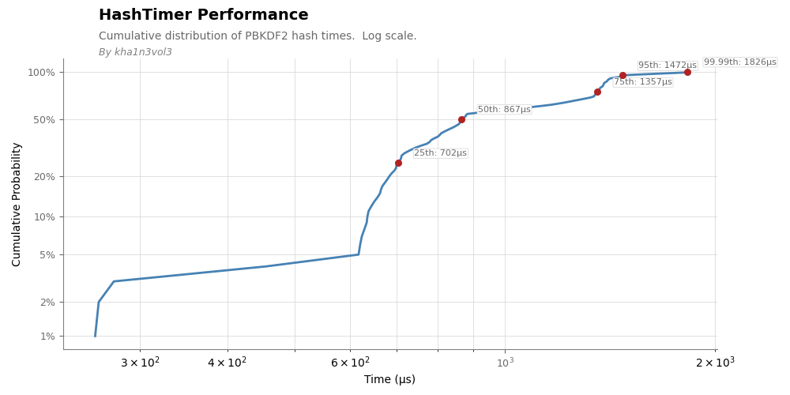

# HashTimer

**HashTimer** is a specialized tool for analyzing PBKDF2 hash timing distributions with real-time monitoring and statistical analysis. It is designed for security researchers and developers studying hash timing characteristics and potential side-channel patterns.

# Example
```
██╗  ██╗ █████╗ ███████╗██╗  ██╗       
██║  ██║██╔══██╗██╔════╝██║  ██║       
███████║███████║███████╗███████║       
██╔══██║██╔══██║╚════██║██╔══██║       
██║  ██║██║  ██║███████║██║  ██║       
╚═╝  ╚═╝╚═╝  ╚═╝╚══════╝╚═╝  ╚═╝       
                                       
████████╗██╗███╗   ███╗███████╗██████╗ 
╚══██╔══╝██║████╗ ████║██╔════╝██╔══██╗
   ██║   ██║██╔████╔██║█████╗  ██████╔╝
   ██║   ██║██║╚██╔╝██║██╔══╝  ██╔══██╗
   ██║   ██║██║ ╚═╝ ██║███████╗██║  ██║
   ╚═╝   ╚═╝╚═╝     ╚═╝╚══════╝╚═╝  ╚═╝
                                       


============================================================================================================
Current      Count    Min          25th         50th         75th         95th         99th         Max         
============================================================================================================
261.04 μs    52       258.63 μs    698.63 μs    865.38 μs    1354.46 μs   1471.63 μs   1821.84 μs   1825.54 μs  
1177.58 μs   53       258.63 μs    699.13 μs    866.62 μs    1352.33 μs   1471.38 μs   1819.99 μs   1825.54 μs  
729.92 μs    54       258.63 μs    699.63 μs    865.38 μs    1350.21 μs   1471.13 μs   1818.13 μs   1825.54 μs  
980.58 μs    55       258.63 μs    702.09 μs    866.62 μs    1349.09 μs   1470.89 μs   1816.28 μs   1825.54 μs  
1358.75 μs   56       258.63 μs    704.56 μs    872.19 μs    1354.46 μs   1470.64 μs   1814.43 μs   1825.54 μs  
4401.21 μs   57       258.63 μs    707.03 μs    877.75 μs    1358.72 μs   1581.49 μs   4220.91 μs   4401.21 μs  
767.50 μs    58       258.63 μs    709.50 μs    872.19 μs    1358.71 μs   1573.08 μs   4195.16 μs   4401.21 μs  
806.50 μs    59       258.63 μs    709.86 μs    866.62 μs    1356.58 μs   1564.66 μs   4169.40 μs   4401.21 μs  
636.87 μs    60       258.63 μs    704.56 μs    865.38 μs    1354.46 μs   1556.25 μs   4143.64 μs   4401.21 μs  
655.92 μs    61       258.63 μs    699.13 μs    864.13 μs    1352.33 μs   1547.84 μs   4117.89 μs   4401.21 μs  
887.46 μs    62       258.63 μs    699.63 μs    865.38 μs    1350.21 μs   1539.43 μs   4092.13 μs   4401.21 μs
```

## Introduction

HashTimer is a Python-based command-line utility that continuously measures the timing of PBKDF2-HMAC-SHA256 operations. It stores the results and processes them in real time using T-Digest statistics. This tool is ideal for identifying timing variations that may hint at side-channel vulnerabilities or performance anomalies.

## Core Features

### Purpose
- **Monitor** PBKDF2 hash timing behavior
- **Collect** and analyze statistical data
- **Identify** timing patterns and anomalies
- **Support** side-channel research
- **Store** data efficiently for long-term analysis

### Measurement
- Real-time timing measurements with microsecond precision
- Configurable parameters:
  - Password
  - Salt
  - Iteration count
  - Key size
  - Measurement interval

### Analysis
- Live statistics via T-Digest
- Tracks key percentiles (e.g., 0, 25, 50, 75, 95, 99, 100)
- Detects outliers automatically
- Memory-efficient data compression
- Continuous monitoring

### Data Management
- Timestamped measurements
- JSON-based T-Digest storage
- CSV timing logs
- Automatic data compression
- Clean shutdown and data preservation

## Installation

```bash
# Clone repository
git clone https://github.com/yourusername/hashtimer.git
cd hashtimer

# Make scripts executable
chmod +x setup.sh hashmeter.py

# Setup environment
./setup.sh

# Activate environment
source .venv/bin/activate
```

## Basic Usage

Run with default parameters:
`python hashmeter.py`

Override defaults:
`python hashmeter.py --iterations 2000 --interval 10`

### Command Line Options
| Option            | Description                                      | Default Value          |
|--------------------|--------------------------------------------------|------------------------|
| `--password`       | Password to hash                                | `mysecretpassword`     |
| `--salt`           | Salt for hashing                                | `somesalt`             |
| `--iterations`     | Number of iterations                            | `1000`                 |
| `--key-size`       | Key size in bytes                               | `32`                   |
| `--interval`       | Measurement interval in seconds                 | `15`                   |
| `--data-dir`       | Directory for storing data files                | `data`                 |

## Data File Structure

```
data/
├── hashmeter.json           # T-Digest statistical data
└── timing_values_*.log      # Raw timing measurements
```

### File Formats

**T-Digest (`hashmeter.json`):**
```json
{
    "centroids": [
        {"m": 268.42, "c": 1.0}
    ]
}
```
- `m`: Centroid mean
- `c`: Centroid count

**Timing Logs:**
```
2024-01-20T15:30:45.123456,268.42
2024-01-20T15:31:00.234567,275.81
```
- Timestamp: ISO 8601 format
- Timing: Microseconds (µs)

## Performance Characteristics

- **Memory Usage**: `O(log n)` with T-Digest compression
- **Storage Efficiency**: Compressed statistical representation
- **Timing Precision**: Microsecond resolution

## Dependencies

- Python 3.11+ (recommended)
- `uvloop`: Enhanced async event loop
- `tdigest`: Efficient percentile calculation
- `hashlib`: Cryptographic hash functions

## Use Cases

- **Security Research**:
  - Timing attack feasibility studies
  - Side-channel analysis
- **Performance Monitoring**:
  - System timing consistency checks
- **Development Support**:
  - Performance regression detection

## Maintenance Tasks

- Automatic T-Digest compression
- Timestamped log rotation
- Clean shutdown preservation

## Common Issues and Solutions

| Problem                | Solution                                     |
|------------------------|---------------------------------------------|
| Installation Problems  | Verify Python version and environment setup |
| Runtime Errors         | Check permissions and resources             |
| Data Collection Issues | Verify system load and file permissions     |

## Development Roadmap

### Current Version (1.1)
- Basic timing collection
- T-Digest implementation
- Command line interface

### Planned Features (1.2)
- Real-time visualization
- Advanced statistical analysis

### Future (2.0+)
- GUI interface
- Cloud storage integration
- Machine learning analysis

## Contributing

1. Fork the repository
2. Create a feature branch
3. Follow coding standards
4. Submit a pull request

## License

This project is licensed under the MIT License. See the `LICENSE` file for details.
